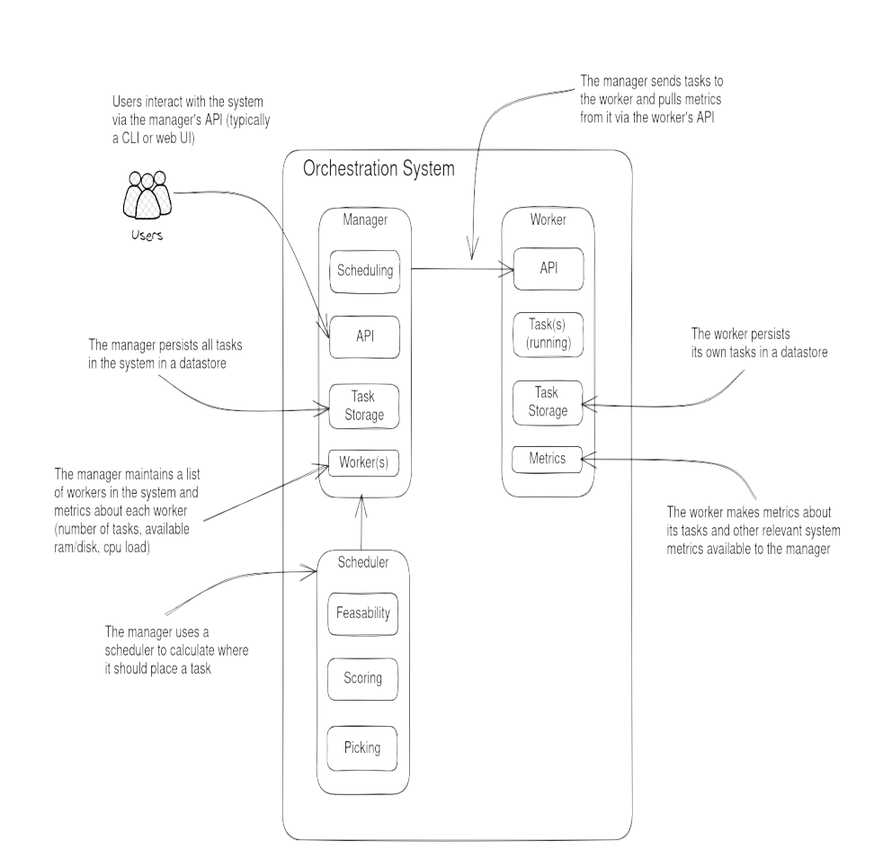

# Architecture

Kraken is split into two long-running processes — the **manager** and the
**worker** — plus a **scheduler** the manager consults when placing tasks.
Users interact with the system through the manager's API (typically a CLI or
web UI).

## Overview

## Components

### Manager

The control plane. The manager:

- Exposes the user-facing **API** for submitting and querying tasks.
- Maintains the authoritative **task storage** — every task in the system.
- Tracks the set of **workers** and their current metrics (task count,
  available RAM/disk, CPU load).
- Delegates placement decisions to the scheduler, then dispatches the task to
  the chosen worker.

### Worker

The data plane. One worker runs on each machine in the cluster. The worker:

- Exposes an **API** the manager calls to start, stop, and query tasks.
- Runs the tasks assigned to it and keeps them alive.
- Persists its own task state in local **task storage**.
- Reports **metrics** about its tasks and the host system back to the manager.

### Scheduler

The placement engine, invoked by the manager. It runs three phases:

1. **Feasibility** — filter workers that cannot run the task at all
   (insufficient resources, missing capabilities).
2. **Scoring** — rank the remaining workers by fitness.
3. **Picking** — choose the highest-scoring worker.

### Node

The representation of a physical or virtual machine in the cluster. Workers
run on nodes; the manager tracks nodes as the underlying capacity it schedules
against.
