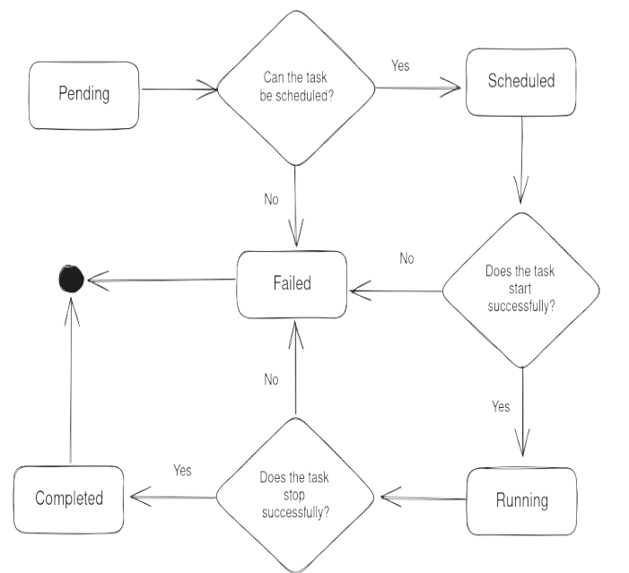

# Tasks

A task is the unit of work in Kraken. Users submit tasks to the manager, which
schedules them onto a worker. Each task moves through a well-defined
lifecycle.

## Lifecycle

## States

| State       | Meaning                                                                                                                                              |
| ----------- | ---------------------------------------------------------------------------------------------------------------------------------------------------- |
| `Pending`   | The task has been submitted and enqueued, but the scheduler has not yet placed it.                                                                   |
| `Scheduled` | The scheduler has chosen a worker. The task is being sent to that worker, or the worker is starting it.                                              |
| `Running`   | The worker successfully started the task and it is currently executing.                                                                              |
| `Completed` | The task finished its work successfully, or was stopped cleanly by a user.                                                                           |
| `Failed`    | The task could not be scheduled, failed to start, crashed while running, or failed to stop cleanly. Terminal — a failed task does not retry itself.  |

## Transitions

- `Pending → Scheduled` — scheduler found a feasible worker and picked one.
- `Pending → Failed` — no worker can run the task.
- `Scheduled → Running` — the chosen worker started the task.
- `Scheduled → Failed` — the worker rejected or failed to start the task.
- `Running → Completed` — the task exited cleanly, or a user stopped it cleanly.
- `Running → Failed` — the task crashed or could not be stopped cleanly.

`Completed` and `Failed` are terminal states.
