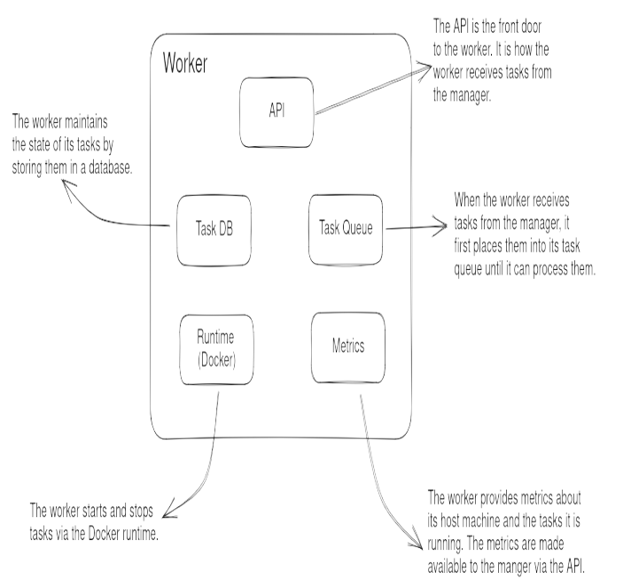

# Worker

The worker is the data plane of Kraken. One worker process runs on each
machine in the cluster. It accepts tasks from the manager, runs them through
a container runtime, persists their state locally, and reports metrics back to
the manager.

## Components

The worker is made up of five components:

### API

The front door to the worker. The manager calls into this API to submit new
tasks, stop running tasks, and query state. The API also exposes the
worker's metrics back to the manager.

### Task Queue

Incoming tasks from the manager are not started immediately. They are
placed on the task queue first and pulled off by the worker for processing.
The queue decouples task arrival from task execution and gives the worker a
single place to apply ordering and back-pressure.

### Task DB

The worker's local store of task state. Every task the worker is currently
running, or has run, is recorded here. The DB is the worker's source of truth
for its own tasks — separate from, and reconciled with, the manager's
authoritative task storage.

### Runtime (Docker)

The component that actually starts and stops tasks. Kraken uses Docker as
its runtime: the worker translates a task definition into Docker SDK calls to
pull the image, create the container, start it, and tear it down on exit.

### Metrics

The worker collects metrics about the host machine (CPU, memory, disk)
and about each task it is running, and exposes them through the API. The
manager pulls these metrics to make scheduling decisions.

## Scope of the current build-out

The first pass through the worker focuses on three of the five components:

- **Runtime** — the Docker integration is in [task/task.go](../task/task.go).
- **Task Queue** — to be added next.
- **Task DB** — to be added next.

The **API** and **Metrics** components are deferred to later chapters.
